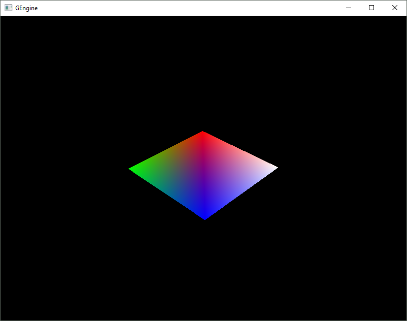
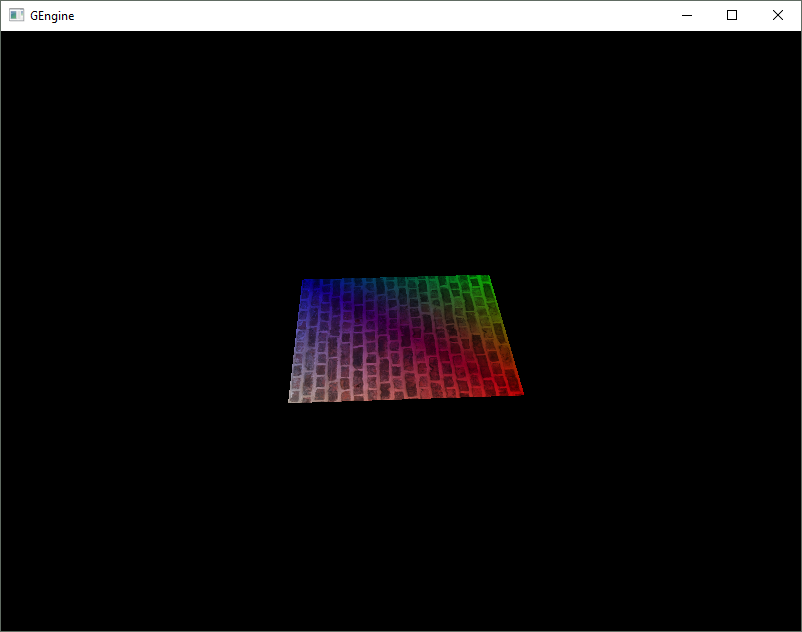
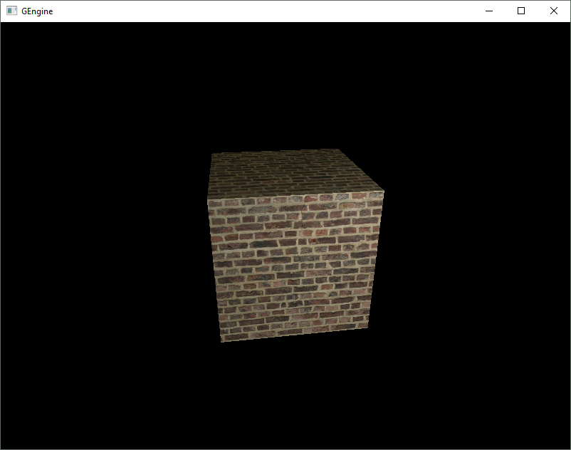
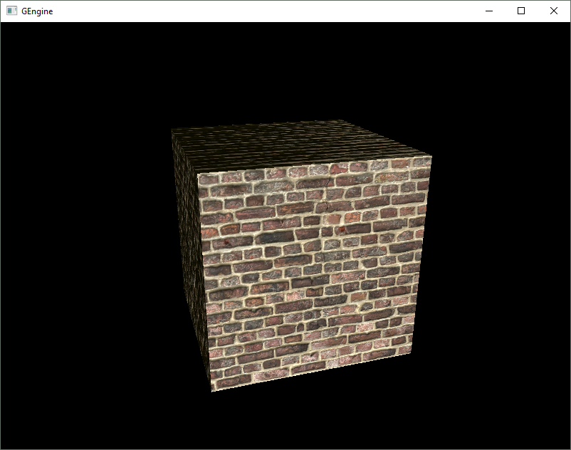

# GEngine

[Griffone's](https://github.com/Griffone) passion and experimentation project.

Initially planned as a multi-purpose hardware-accelerated skillset demo with somewhat clear development history. Secondary goal was to create a platform from which to jump from for other projects.

The first achievement was the initial Vulkan API based hardware-accelerated image rendering:

[Vulkan](https://www.khronos.org/vulkan/) is a verbose open-source cross-platform graphics API similar to DirectX 12. It requires a lot of explicit function calls to be used, like VRAM management, whole pipeline creation or swap-chain framebuffer swaps. However thanks to its verbosity it is a great tool for learning how modern GPUs, GPU loads and graphics drivers work.

Then I added a texture to the quad:

After a little mode work I switched to loading a mesh. A simple cube is fairly boring, so I added basic diffuse lighting:

At this point, having experienced minor rewrites to shaders causing significant refactors for rendering code, I realized Vulkan is great if you know exactly what you want to do. But for quick iteration it is somewhat poor due to immense verbosity.

Finally I achieved something that looked remarkable, normal mapping!
